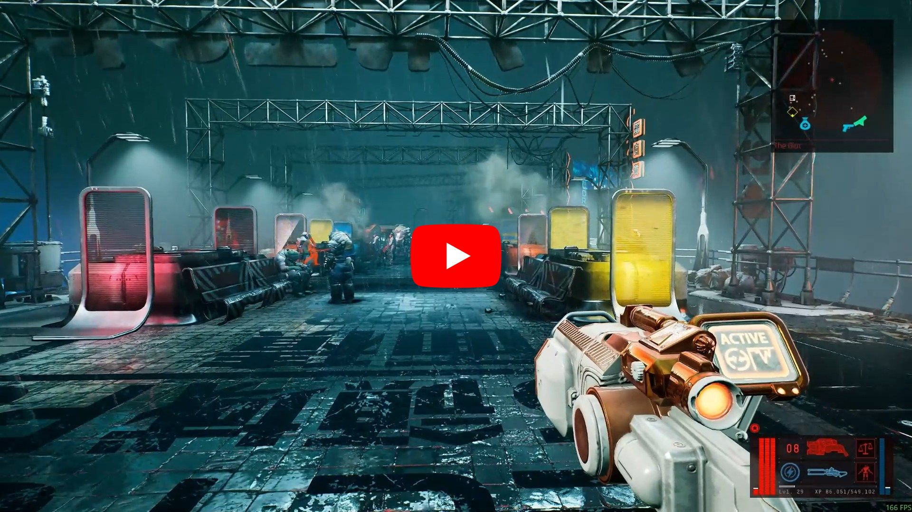
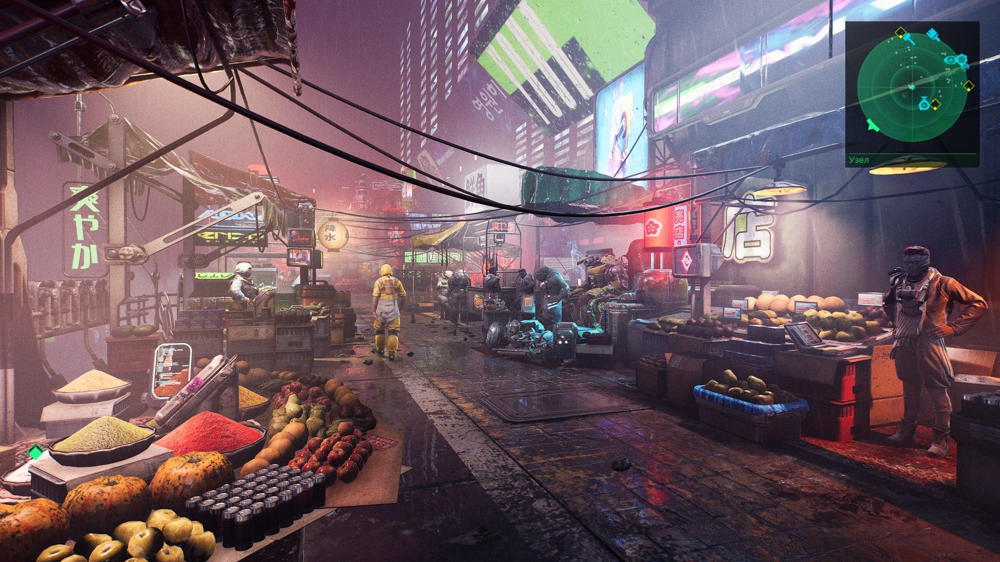
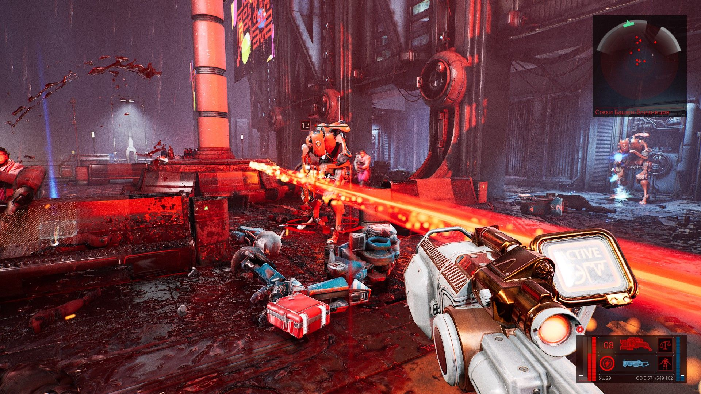
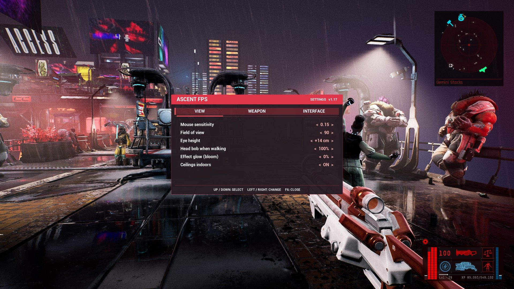

# AscentFPS — first-person mode for The Ascent

**English** | [Русский](README.ru.md)

## Please note!
- This mod was made with the help of AI!
- The game was designed for a top-down view, so I personally recommend playing through it the first
  time the way the developers intended.
- Because of the original perspective, first person reveals holes in textures and other things that
  cannot be seen from above. These have not been fixed and there are currently no plans to fix them.
- I found it much easier to get lost on the map in first person. If you have trouble finding your way,
  you can switch back to the normal view at any time with **F5**, or try the setting that puts a floor
  plan under the radar.
- Despite a lot of testing, crashes are still possible when using the mod. Keep that in mind. I will
  try to fix them.
- This mod is for single-player **only**. In multiplayer modes it switches itself off.

Play **The Ascent** from the character's eyes instead of the top-down camera: free mouse look, movement
that follows your view, a weapon in front of you, a crosshair, and the game's own aiming and shooting
pointed where you look.

It is a single [UE4SS](https://github.com/UE4SS-RE/RE-UE4SS) Lua mod. No pak files, no game files
replaced; delete one folder to remove it.

|  Video demonstration |
| :------------: |
| [](https://www.youtube.com/watch?v=HHdyhu0-VDY)  |

</div>

<div align="center">

<table>
  <tr>
    <td align="center" colspan="2"><br><sub>First-person view</sub></td>
    <td align="center" colspan="2"><br><sub>Action view</sub></td>
    <td align="center" colspan="2"><br><sub>Settings</sub></td>
  </tr>
</table>

</div>


## What the mod adds

**View**
- First-person camera at eye height with unlimited mouse look; adjustable field of view, sensitivity
  and eye height.
- The game's own movement (WASD or gamepad stick), dodge and aiming follow the direction you look.
- Smooth crouching (Ctrl); raising the weapon (right mouse button) while crouched lifts the view, like
  peeking over cover.
- Subtle head bob when walking.
- Ceilings stay in place indoors — the game normally fades them away for the top-down camera. (Not a
  recommended setting: even with ceilings there are hardly any textures up there.)
- Adjustable glow (bloom): muzzle effects are right in front of the lens in first person and would
  otherwise white out the screen. (There are still problems with some weapons that fire very brightly.)

**Weapon**
- The carried weapon is shown as a view model in front of the camera; size and position are adjustable.
- Recoil kick per shot, scaled by the weapon's own stats (slow, heavy weapons kick more; steady beam
  weapons do not kick).
- The weapon's laser sight starts at the muzzle instead of the middle of the screen, and can be turned
  off (better left on).

**Interface**
- Crosshair. (It does not always match where the shots go. Better rely on the laser.)
- Interaction prompts ("[F] Open", lifts, stations, vendors) and hints such as "Access denied" are shown
  under the crosshair instead of at a position that only made sense from above.
- Optional: a live floor plan under the dots of the game's radar, so you can see walls and passages.
- An in-game settings menu.


**Keys**

| Key | Action |
|---|---|
| **F5** | First person on / off (off = the unmodified game) |
| **F6** | Settings menu |

Menus, the journal, vendors, the taxi list, cutscenes and the pause menu get the normal camera and a
free mouse cursor automatically. Alt-tabbing releases the cursor as well.

## Requirements

- The Ascent on Steam (tested on the build with Unreal Engine 4.26), Windows.
- [RE-UE4SS](https://github.com/UE4SS-RE/RE-UE4SS) **v3.0.1**.

## Installation

1. Install RE-UE4SS v3.0.1 into `The Ascent\TheAscent\Binaries\Win64\`
   (so that `dwmapi.dll`, `UE4SS.dll`, `UE4SS-settings.ini` and the `Mods` folder sit next to
   `TheAscent-Win64-Shipping.exe`).
2. Open `UE4SS-settings.ini` and set:
   ```ini
   bUseUObjectArrayCache = false
   GraphicsAPI = dx11
   HookBeginPlay = 0
   ```
3. Open `Mods\mods.txt` and set:
   ```
   BPModLoaderMod : 0
   BPML_GenericFunctions : 0
   ```
4. Copy the `AscentFPS` folder from this repository into `Binaries\Win64\Mods\`.
   It contains `enabled.txt`, so it loads without an entry in `mods.txt`.
5. Start the game and load a single-player save. First person is on by default.

Steps 2 and 3 are not optional: with the default settings UE4SS itself crashes this game — on the
main menu (`bUseUObjectArrayCache`) and at random while levels stream in, most often in combat
(`HookBeginPlay`).

**Uninstall:** delete `Mods\AscentFPS` (or only its `enabled.txt` to disable it).

## Settings

Press **F6** in game. Up / Down selects a row, Left / Right changes the value (hold to repeat), Enter
toggles or resets. To switch tabs, move up onto the tab bar and press Left / Right. Changes apply
immediately and are saved to `Mods\AscentFPS\AscentFPS.cfg`.


### Console

The same settings are available in the UE console (**F10**, enabled by UE4SS): `afps` prints the
current values, `afps <name> <value>` sets one, `afps reset` restores the defaults, `afps toggle` is
the same as F5.

| Name | Setting | | Name | Setting |
|---|---|---|---|---|
| `sens` | mouse sensitivity | | `weapon` | weapon in view (0/1) |
| `fov` | field of view | | `wsize` | weapon size, % |
| `eye` | eye height, cm | | `wfwd` | weapon distance from eyes, cm |
| `bob` | head bob, % | | `wright` | weapon to the right, cm |
| `bloom` | glow, % (−1 = game default) | | `wdown` | weapon lower, cm |
| `roofs` | ceilings indoors (0/1) | | `recoil` | recoil, % |
| `crosshair` | crosshair (0/1) | | `laser` | laser sight (0/1) |
| `radar` | geometry on the radar (0/1) | | | |

## Known limitations

- **Aiming is horizontal**, exactly as in the original game: you choose the direction, the game picks
  the height (it shoots level from chest height and auto-aims at targets). The vertical position of
  the crosshair does not steer shots, and standing right behind a railing can make shots hit it.
- Your own body is hidden. The weapon view model has no arms and no reload animation, and one position
  is used for all weapons, so bulky ones take up more of the screen.
- The world was built to be seen from above: distant scenery is less detailed at eye level, and rooms
  whose ceiling was never modelled stay open.
- The glow setting dims bloom for the whole picture, neon signs included. Very bright weapons still
  light up nearby fog.
- Geometry on the radar is a small live top-down render: dark in dark places, steam shows as white
  blobs, and it reduces the frame rate a little.
- When an interaction prompt is off screen for the game's own maths, the mod shows a plain text line
  with the same key and label instead of the game's styled prompt.
- The settings menu is keyboard-only.
- First person draws more of the world than the top-down camera, so expect a lower frame rate than in
  the unmodified game.
- Not every weapon type has been tried.

## Troubleshooting

- **The game crashes on the main menu or randomly in combat** — check steps 2 and 3 of the installation.
- **Mouse look does not work and a cursor is visible** — a game menu is (or is believed to be) open.
  Press F5 twice; if it keeps happening in the same place, please report where.
- **Nothing happens after loading** — look at `Mods\AscentFPS\AscentFPS.log` and `UE4SS.log` next to
  the game executable.

## Files

```
AscentFPS/
  enabled.txt          makes UE4SS load the mod
  Scripts/main.lua     bootstrap: log, hooks, console command
  Scripts/fps.lua      everything else
```

Created at runtime inside `Mods\AscentFPS\`: `AscentFPS.cfg` (settings) and `AscentFPS.log`.

## Credits

- Built with an AI coding agent (Claude Code) and the universal-modder toolkit; tested in the game by a
  human player.
- [RE-UE4SS](https://github.com/UE4SS-RE/RE-UE4SS) by the UE4SS-RE team.
- The Ascent is © Neon Giant / Curve Games. This repository contains no game files or game assets.

## License

[MIT](LICENSE)
